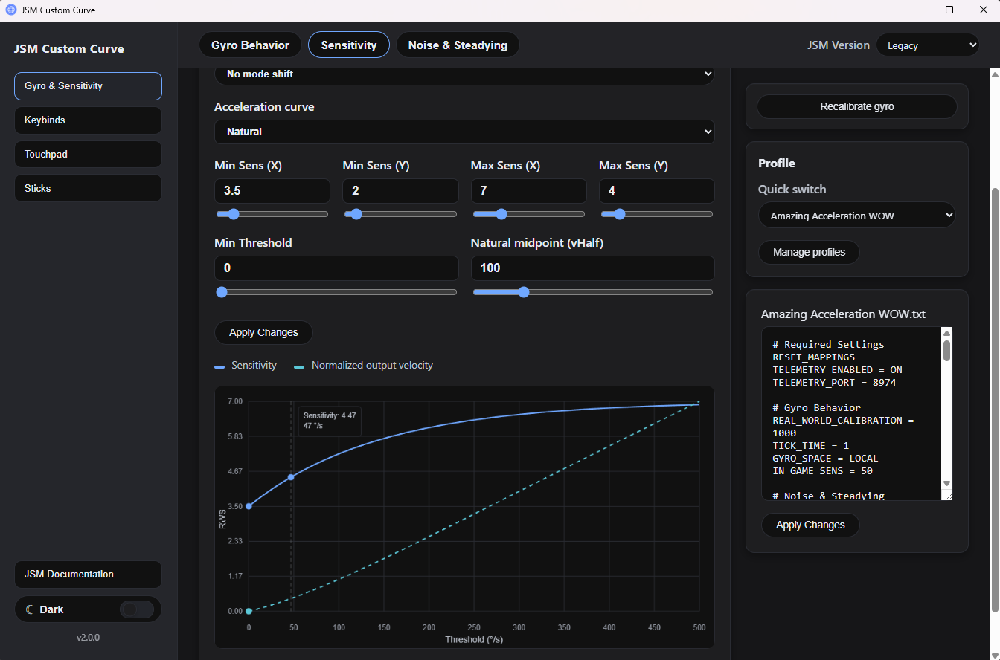
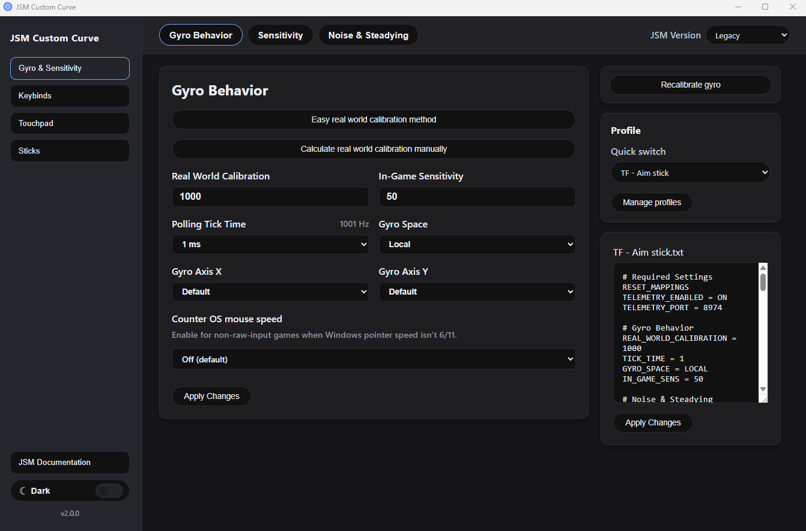
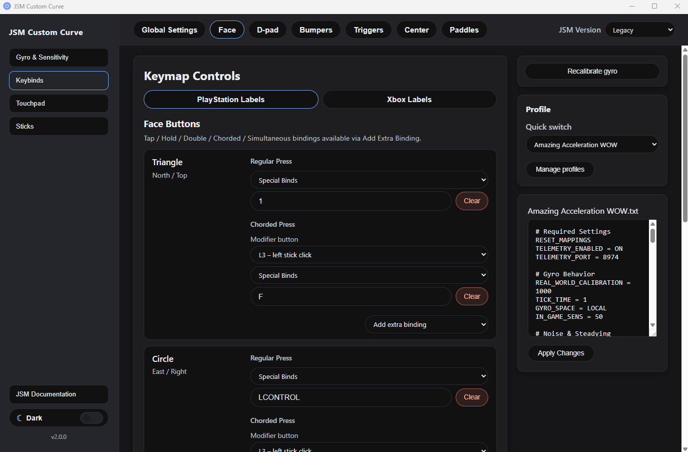

# JoyShockMapper Custom Curve

A community fork of [JoyShockMapper](https://github.com/Electronicks/JoyShockMapper) that adds custom features such as acceleration curves and a user interface for creating configurations. For full JSM command documentation, use the built-in documentation page inside the app.

## Quick Start
- Download and run the installer (Windows): [Latest release](https://github.com/evan1mclean/JSM_custom_curve/releases)
- Windows SmartScreen warning: When first launching, Windows Defender may flag the app as a potential risk. This is because the app is unsigned and I don't want to pay money to do it... click **More info** then **Run anyway**
- If using [HidHide](https://github.com/nefarius/HidHide) — a tool that hides your controller from games to prevent double inputs when using a full keyboard and mouse layout — whitelist the JoyShockMapper.exe in both `JoyShockMapper Custom Curve\resources\bin\SDL` and `\Legacy` folders
- The app launches JSM in the background when it starts and shuts it down when you close the GUI
- The app will automatically check for new updates on launch

## What's Different from Upstream JSM

### Custom JSM Features
- **Custom acceleration curves**: Natural, Power, Quadratic, Sigmoid, and Jump curves
- **One Euro Filter**: Adaptive low-pass filter that suppresses jitter at rest while letting fast movement through with minimal latency
- **Gyro smoothing decay**: Makes the smoothing window shrink as gyro speed increases, so fast inputs receive progressively less smoothing
- **Yaw + Roll gyro space** with adjustable roll contribution
- **Gyro angle snapping** with optional smooth ease transition
- **Deceleration brake** to reduce cursor overshoot after fast flicks

<div align="center">

</div>

## GUI Features

The GUI covers most JSM settings without touching the command line. For advanced settings not surfaced in the UI, the built-in config editor lets power users add anything manually.

- Live sensitivity graph
- Keybind mapping with click-to-capture input
- Profile library with quick switching and one-click apply
- In-app JSM documentation with search
- Guide for getting Real World Calibration for a given game
- SDL / Legacy backend switcher
- Light and dark theme toggle

<div align="center">


</div>

## Installation for Devs

> Windows only. Linux support contributions welcome.

### Build JoyShockMapper — SDL version
```bash
mkdir build-jsm-sdl && cd build-jsm-sdl
cmake .. -G "Visual Studio 17 2022" -A x64 -D SDL=ON
cmake --build . --config Release
```
Optional tests:
```bash
cmake .. -G "Visual Studio 17 2022" -A x64 -D SDL=ON -DBUILD_JSM_TESTS=ON
cmake --build . --config Release
cd JoyShockMapper
ctest --build-config Release
```
Copy the built `JoyShockMapper.exe` into `JSM_GUI/jsm-gui-app/bin/SDL/`

### Build JoyShockMapper — Legacy version
```bash
mkdir build-jsm-legacy && cd build-jsm-legacy
cmake .. -G "Visual Studio 17 2022" -A x64 -D SDL=OFF -DBUILD_SHARED_LIBS=ON
cmake --build . --config Release
```
Copy the built binaries into `JSM_GUI/jsm-gui-app/bin/legacy/`

### GUI App
```bash
cd JSM_GUI/jsm-gui-app
npm install
npm run dev      # dev server with hot reload
npm run build    # production build + NSIS installer via electron-builder
```

## Links
- Full JSM documentation: https://github.com/Electronicks/JoyShockMapper
- GyroWiki: http://gyrowiki.jibbsmart.com
