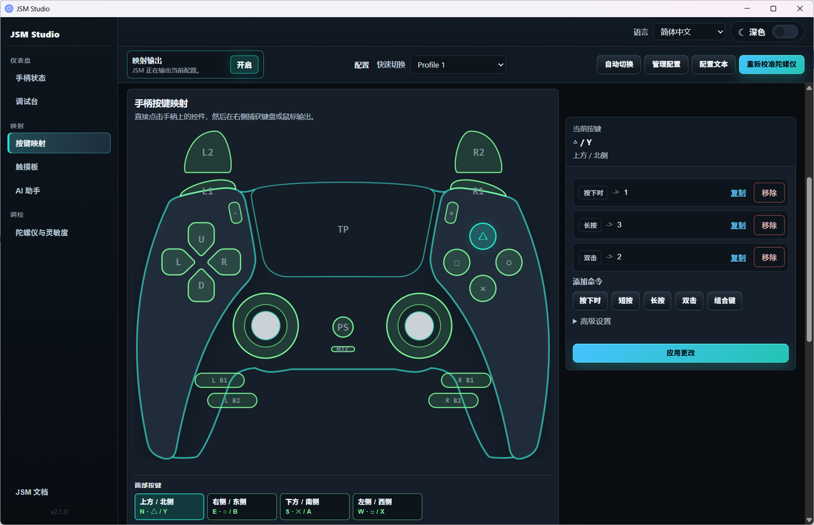
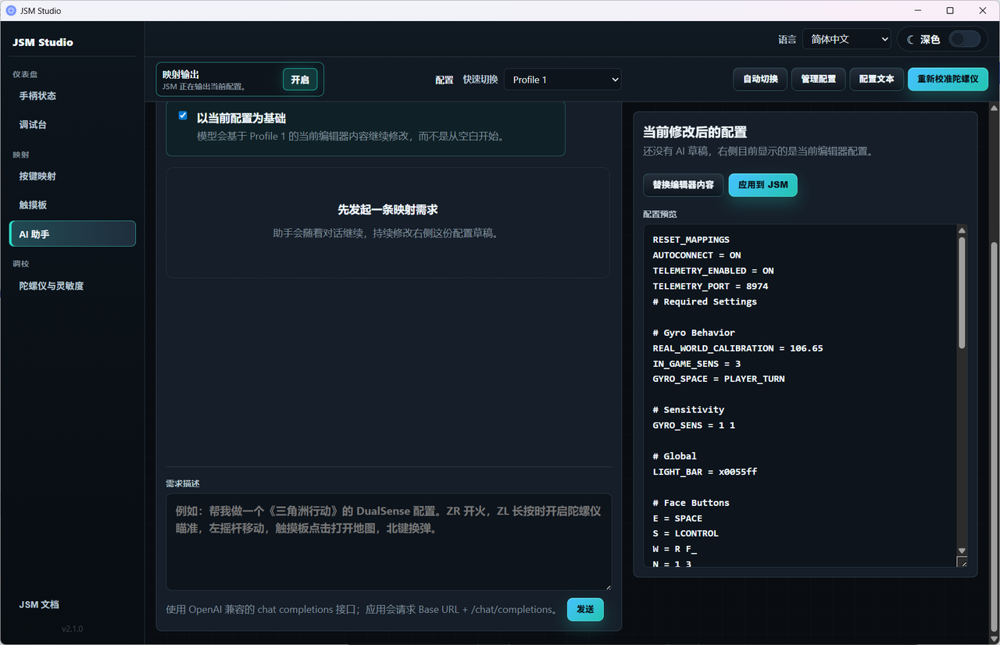
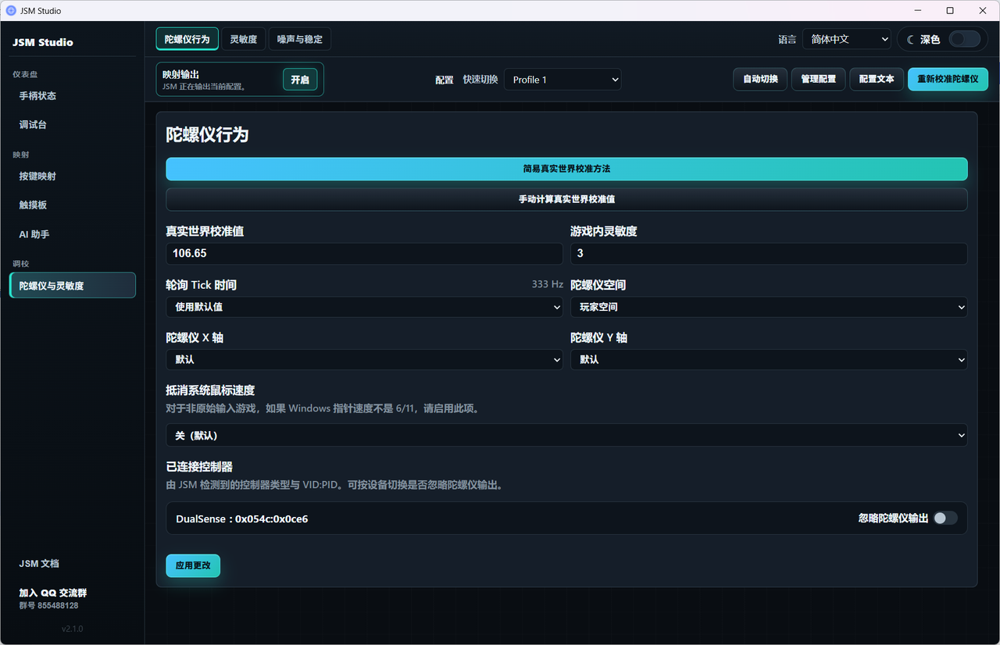

# JSM Studio

[`Chinese Documentation`](./README_zh.md)

JSM Studio is a graphical tool for JoyShockMapper on Windows. It integrates JoyShockMapper’s gyro aiming, key mapping, config management, and HidHide controller-hiding workflow into a single desktop application, aiming to enable users to complete common configuration tasks without using the command line.


This repository is a fork of [`evan1mclean/JSM_custom_curve`](https://github.com/evan1mclean/JSM_custom_curve). The upstream repo itself is based on JoyShockMapper, adding custom curves, filtering, and GUI configuration capabilities; this fork further extends it into a more complete JSM Studio desktop tool.

## Download

Download the latest installer from GitHub Releases:

[Download Latest JSM Studio](https://github.com/hotuns/JSM_Studio/releases/latest)

You can also browse the Releases list for specific versions:

[All Releases](https://github.com/hotuns/JSM_Studio/releases)

Windows users usually just need the `.exe` installer from the Release assets; if you need MSI, you can download the `.msi` file as well.

## Differences from the Forked Upstream

Compared to [`evan1mclean/JSM_custom_curve`](https://github.com/evan1mclean/JSM_custom_curve), major improvements in this repository include:

- **Tauri Desktop App**: GUI has moved to Tauri; backend directly manages JoyShockMapper processes, config files, runtime directories, and system-level operations.
- **Bundled JoyShockMapper Runtime**: The application includes both SDL / legacy backends, switchable via the interface. Users do not need to locate or launch `JoyShockMapper.exe` manually.
- **Reworked Controller Connection Flow**: On launch, JSM Studio no longer connects to all controllers automatically. Instead, it shows available SDL controllers for the user to select and connect.
- **HidHide Integration**: Bundled with the HidHide installer. When you need to hide physical controllers, you can install, open HidHide, hide devices, and fix the whitelist via the app.
- **HidHide Whitelist Fix**: The whitelist will prioritize the path to the currently running `JoyShockMapper.exe`, avoiding scenarios where controllers are hidden from both the game and JSM itself.
- **Runs as Administrator by Default**: Windows manifest requests admin privileges to prevent failures in HidHide, input injection, and whitelist fix system operations.
- **Enhanced Config Management**: Provides config directories, text editing, management, fast switching, and automatic per-game switching panels.
- **Redesigned Auto-Switch Panel**: Supports loading configs based on game process rules; rules and their enabled status are managed in the GUI.
- **Redesigned Controller Status Page**: Prompts for controller selection when not connected; after connecting, shows real-time input status and HidHide actions.
- **Reworked Touchpad Interaction**: Select touchpad mode/dividing method first, then assign mappings to different touch areas.
- **Overall UI Refactor**: Redundant top bar removed, clearer tooltips, unified left navigation bar, language/appearance switch, and global controls’ styling.
- **Automated Release Build**: GitHub Actions workflows build and upload Windows installers to Releases automatically when pushing a `v*` tag.

## Main Features

- Controller detection, selection, and real-time input view
- Enable/disable mapping output
- Button mapping, touchpad mapping, gyro & sensitivity configuration
- Config file management, editing, and quick switching
- Auto-switch profiles by game process
- Built-in installation, access, and fixing for HidHide and whitelist
- Embedded JSM documentation links
- Simplified Chinese / English interface
- Dark theme





## Basic Usage Steps

1. Install and run JSM Studio as administrator.
2. On the "Controller Status" page, refresh device list and connect your preferred controller.
3. In the "Button Mapping", "Touchpad", or "Gyro & Sensitivity" pages, configure your mappings.
4. Toggle "Enable Mapping" to let JoyShockMapper output your configuration.
5. If your game sees both the physical controller and causes double input, install HidHide in the "HidHide" section and hide the physical controller.
6. Test in game. For automatic profile switching, add the relevant rule in the "Auto-Switch" panel.

## About HidHide

HidHide is used to hide physical controllers from games, letting only JoyShockMapper read the controller input. This avoids double input caused by both the real controller and JSM being recognized together.

JSM Studio will always add the currently running `JoyShockMapper.exe` to the HidHide whitelist. If you reinstall, switch backend, or move directories, the app will check and repair the whitelist on startup, device refresh, or when hiding a device.

If JSM Studio can't see controllers after hiding, check these:

- JSM Studio is running as administrator.
- HidHide is enabled.
- HidHide whitelist includes the current internal `JoyShockMapper.exe`.
- The "Fix Whitelist" button has been clicked or JSM Studio has been restarted.

## Auto-Switch Configuration

Auto-switching works by matching running game process names. Each rule maps a game `.exe` to a JSM config file. When the foreground window switches to that game, JSM Studio will auto-load the matching config.

How to use:

1. Prepare a config file in the Config Manager.
2. In the Auto-Switch panel, enable "Auto-Switch by Game".
3. Add a rule by selecting the game process name and profile file.
4. Launch the game and switch to its window. JSM Studio will switch configs per your rule.

Note: The rule name should match the actual game process, e.g. `game.exe`. If you’re unsure, check the process name in Task Manager when the game is running.

## Development

### Environment

- Windows
- Node.js
- Rust
- Visual Studio Build Tools / MSVC
- CMake

### Run Tauri Dev Version

```powershell
cd JSM_GUI/jsm_gui_tauri
npm install
npm run tauri:dev:admin
```

`tauri:dev:admin` starts the dev version with admin rights for testing HidHide, input injection, and whitelist fix features.

### Build Installer

```powershell
cd JSM_GUI/jsm_gui_tauri
npm run tauri:build
```

After building, installers are usually found at:

```text
JSM_GUI/jsm_gui_tauri/src-tauri/target/release/bundle/nsis/
JSM_GUI/jsm_gui_tauri/src-tauri/target/release/bundle/msi/
```

## Release

This repository uses GitHub Actions to automatically publish Windows installers.

Push a version tag:

```powershell
git tag -a v0.2.1 -m "JSM Studio v0.2.1"
git push origin v0.2.1
```

GitHub Actions will build and upload `.exe` / `.msi` files to the corresponding GitHub Release.

## Upstream & Related Projects

- This repo: [`hotuns/JSM_Studio`](https://github.com/hotuns/JSM_Studio)
- Forked upstream: [`evan1mclean/JSM_custom_curve`](https://github.com/evan1mclean/JSM_custom_curve)
- JoyShockMapper: [`JibbSmart/JoyShockMapper`](https://github.com/JibbSmart/JoyShockMapper)
- HidHide: [`nefarius/HidHide`](https://github.com/nefarius/HidHide)
- GyroWiki: [`gyrowiki.jibbsmart.com`](http://gyrowiki.jibbsmart.com)

## License

JoyShockMapper uses the MIT License. See [LICENSE.md](LICENSE.md) for details.