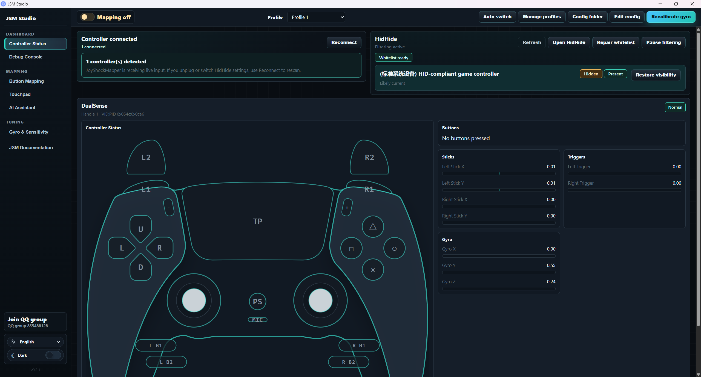

# JSM Studio

[`英文文档`](./README.md)

JSM Studio 是一个面向 Windows 的 JoyShockMapper 图形化工具。它把 JoyShockMapper 的体感瞄准、按键映射、配置管理和 HidHide 手柄隐藏流程整合到一个桌面应用里，目标是让用户不用直接面对命令行也能完成常见配置。




本仓库是 [`evan1mclean/JSM_custom_curve`](https://github.com/evan1mclean/JSM_custom_curve) 的 fork。源仓库本身基于 JoyShockMapper，并加入了自定义曲线、滤波和 GUI 配置能力；本仓库在此基础上继续改造成更完整的 JSM Studio 桌面工具。

## 下载

从 GitHub Release 下载最新版安装包：

[下载最新版 JSM Studio](https://github.com/hotuns/JSM_Studio/releases/latest)

也可以进入 Release 列表选择具体版本：

[全部 Release](https://github.com/hotuns/JSM_Studio/releases)

Windows 用户通常下载 Release 附件里的 `.exe` 安装包即可；如果需要 MSI，也可以下载 `.msi` 文件。

## 与 fork 源仓库的区别

相对 [`evan1mclean/JSM_custom_curve`](https://github.com/evan1mclean/JSM_custom_curve)，本仓库重点变化如下：

- **Tauri 桌面应用**：GUI 已迁移到 Tauri，后端直接管理 JoyShockMapper 进程、配置文件、运行时目录和系统级操作。
- **内置 JoyShockMapper 运行时**：应用内置 SDL / legacy 后端，并通过界面切换，不要求用户手动寻找或启动 `JoyShockMapper.exe`。
- **手柄连接流程重做**：启动后不会自动连接所有手柄，而是先显示可用 SDL 手柄，由用户点击选择要连接的设备。
- **HidHide 集成**：内置 HidHide 安装包，用户需要隐藏实体手柄时可在应用内安装、打开 HidHide、隐藏设备、修复白名单。
- **HidHide 白名单修复**：白名单会优先使用当前实际启动的 `JoyShockMapper.exe` 路径，避免手柄被隐藏后 JSM 自己也看不到设备。
- **默认管理员运行**：Windows manifest 要求管理员权限，避免 HidHide、输入注入、白名单修复等系统操作失败。
- **配置管理增强**：提供配置目录、配置文本编辑、配置管理、快速切换和按游戏自动切换面板。
- **自动切换面板重做**：支持按游戏进程规则加载配置，规则文件与开关状态在 GUI 中管理。
- **手柄状态页重做**：未连接手柄时优先引导用户选择手柄，连接后再显示实时输入状态和 HidHide 操作。
- **触摸板交互重做**：先选择触摸板模式/分割方式，再为不同触摸区域分配映射。
- **整体 UI 重构**：移除冗余顶部栏，简化工具文案，统一左侧导航、语言切换、主题切换和全局控制区样式。
- **Release 自动构建**：仓库包含 GitHub Actions 发布流程，推送 `v*` tag 后自动构建 Windows 安装包并上传到 GitHub Release。

## 主要功能

- 手柄检测、选择连接和实时输入查看
- 映射开启 / 关闭
- 按键映射、触摸板映射、陀螺仪与灵敏度配置
- 配置文件管理、编辑和快速切换
- 按游戏进程自动切换配置
- HidHide 安装、打开、隐藏设备和白名单修复
- 内置 JSM 文档入口
- 简体中文 / English 界面
- 深色主题


## 基础使用流程

1. 安装并以管理员权限启动 JSM Studio。
2. 在「手柄状态」页面刷新设备列表，点击要使用的手柄进行连接。
3. 在「按键映射」「触摸板」「陀螺仪与灵敏度」页面配置映射。
4. 打开「映射开启」开关，让 JoyShockMapper 输出当前配置。
5. 如果游戏会同时识别实体手柄并造成双输入，在「HidHide」区域安装 HidHide，然后隐藏实体手柄。
6. 进入游戏测试。如果需要按游戏自动切换配置，在「自动切换」面板添加对应游戏进程规则。

## HidHide 说明

HidHide 用来把实体手柄从游戏中隐藏，只让 JoyShockMapper 继续读取手柄输入。这样可以避免游戏同时收到实体手柄输入和 JSM 输出造成双输入。

JSM Studio 会自动把当前实际启动的 `JoyShockMapper.exe` 加入 HidHide 白名单。如果用户重新安装、切换后端或移动程序目录，应用会在启动、刷新设备或隐藏设备时重新检查白名单。

如果隐藏后 JSM Studio 看不到手柄，通常检查这几项：

- JSM Studio 是否以管理员权限启动。
- HidHide 是否启用。
- HidHide 白名单是否包含当前版本内置的 `JoyShockMapper.exe`。
- 是否点击过「修复白名单」或重启过 JSM Studio。

## 自动切换配置

自动切换基于游戏进程名工作。每条规则对应一个游戏 `.exe` 和一个 JSM 配置文件。当前台窗口切换到该游戏时，JSM 会自动加载对应配置。

使用方式：

1. 打开配置管理，准备一个要用于游戏的配置。
2. 进入自动切换面板，开启「按游戏自动切换」。
3. 添加规则，选择游戏进程名和配置文件。
4. 启动游戏并切到游戏窗口，JSM Studio 会按规则加载配置。

注意：规则名应对应实际游戏进程，例如 `game.exe`。如果不确定进程名，可以先运行游戏，再从任务管理器查看。

## 开发

### 环境

- Windows
- Node.js
- Rust
- Visual Studio Build Tools / MSVC
- CMake

### 运行 Tauri 开发版

```powershell
cd JSM_GUI/jsm_gui_tauri
npm install
npm run tauri:dev:admin
```

`tauri:dev:admin` 会以管理员权限启动开发版，便于测试 HidHide、输入注入和白名单修复。

### 构建安装包

```powershell
cd JSM_GUI/jsm_gui_tauri
npm run tauri:build
```

构建完成后，安装包通常位于：

```text
JSM_GUI/jsm_gui_tauri/src-tauri/target/release/bundle/nsis/
JSM_GUI/jsm_gui_tauri/src-tauri/target/release/bundle/msi/
```

## 发布

本仓库使用 GitHub Actions 自动发布 Windows 安装包。

推送版本 tag：

```powershell
git tag -a v0.2.1 -m "JSM Studio v0.2.1"
git push origin v0.2.1
```

GitHub Actions 会自动构建并把 `.exe` / `.msi` 上传到对应 GitHub Release。

## 上游与相关项目

- 本仓库：[`hotuns/JSM_Studio`](https://github.com/hotuns/JSM_Studio)
- Fork 源仓库：[`evan1mclean/JSM_custom_curve`](https://github.com/evan1mclean/JSM_custom_curve)
- JoyShockMapper：[`JibbSmart/JoyShockMapper`](https://github.com/JibbSmart/JoyShockMapper)
- HidHide：[`nefarius/HidHide`](https://github.com/nefarius/HidHide)
- GyroWiki：[`gyrowiki.jibbsmart.com`](http://gyrowiki.jibbsmart.com)

## License

JoyShockMapper 使用 MIT License，详见 [LICENSE.md](LICENSE.md)。
