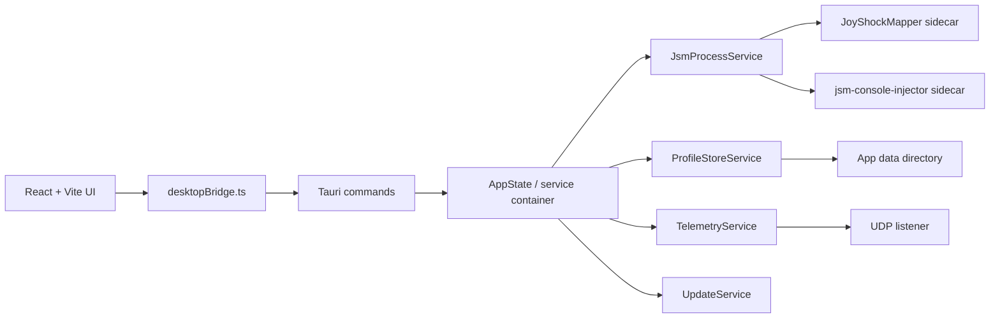

# Tauri Refactor Plan

## 1. Goal

This document describes how to migrate the current `JSM_GUI/jsm-gui-app` desktop shell from Electron to Tauri without rewriting the JoyShockMapper backend or the existing React configuration UI.

The primary goals are:

- reduce installer size and runtime overhead
- keep the existing React + Vite UI and most domain logic
- keep JoyShockMapper (`JoyShockMapper.exe`) and `jsm-console-injector.exe` as bundled native sidecars
- preserve the current profile format, telemetry flow, and calibration workflow
- make the platform layer easier to maintain than the current monolithic `electron/main.ts`

The migration is **not** intended to:

- rewrite JoyShockMapper in Rust
- redesign the configuration model or keymap schema
- add new cross-platform features during the first pass
- fully support non-Windows platforms in the first release

The first Tauri milestone should be treated as a **Windows-first platform migration**.

## 2. Current Architecture Summary

The current desktop app is split into three layers:

1. React renderer in `JSM_GUI/jsm-gui-app/src`
2. Electron integration layer in `JSM_GUI/jsm-gui-app/electron`
3. Native backend binaries in `JSM_GUI/jsm-gui-app/bin`

### 2.1 Renderer

The renderer already has a fairly clean boundary. It does not directly use Node APIs. It talks to the desktop shell through:

- `window.electronAPI`
- `window.telemetry`

That API surface is declared in:

- `JSM_GUI/jsm-gui-app/src/types/global.d.ts`
- `JSM_GUI/jsm-gui-app/electron/electron-env.d.ts`

The main renderer consumers are:

- `src/App.tsx`
- `src/hooks/useTelemetry.ts`
- `src/hooks/useProfileLibrary.ts`
- `src/hooks/useCalibration.ts`
- `src/components/UpdateBanner.tsx`

This is the main reason the migration is feasible: most UI code is already insulated from Electron-specific details.

### 2.2 Electron Main Process

The current `electron/main.ts` is a large integration module that owns all desktop responsibilities:

- launch and terminate `JoyShockMapper.exe`
- launch `jsm-console-injector.exe`
- listen for telemetry on UDP `127.0.0.1:8974`
- push telemetry, calibration status, and update events to the renderer
- manage profile library files and startup command files
- manage backend selection between `SDL` and `legacy`
- run auto-update flow through `electron-updater`
- restore window state

This file is the main migration target.

### 2.3 Native Binaries and Writable Runtime Data

The app currently bundles runtime assets under `bin`, including:

- `bin/SDL/JoyShockMapper.exe`
- `bin/SDL/jsm-console-injector.exe`
- `bin/SDL/OnStartUp.txt`
- `bin/SDL/RecalibrateGyro.txt`
- `bin/profiles-library/*.txt`
- `bin/GyroConfigs/_3Dcalibrate.txt`

The important architectural problem is that the current implementation treats the bundled `bin` area as both:

- application resources
- writable runtime storage

That is workable in the current Electron packaging layout, but it is the wrong model for Tauri and should be fixed before or during migration.

## 3. Why Tauri Is Reasonable Here

This project is a good Tauri candidate for four reasons:

1. The renderer is already framework-agnostic and Vite-based.
2. The desktop shell is mostly a bridge around existing native executables.
3. The backend is already sidecar-shaped.
4. The biggest Electron-specific code is concentrated in one file.

This project is **not** a good "quick port" candidate because the current Electron main process mixes together:

- IPC API definitions
- process management
- telemetry streaming
- updater integration
- file persistence
- backend switching logic

If we migrate, we should split those responsibilities instead of recreating the same large file in Rust.

## 4. Main Constraints

### 4.1 Windows-First Scope

The current app depends on Windows-specific process and console behavior:

- `jsm-console-injector.exe`
- hidden child process startup
- controller reconnect workflow tied to the SDL backend on Windows

The first Tauri release should therefore target Windows only. Cross-platform support can be reconsidered after the platform layer is stabilized.

### 4.2 Telemetry Is a Streaming Problem

Telemetry is not a normal request/response API. The current app continuously receives JSON packets over UDP and pushes them to the renderer.

During migration we should avoid a naive "one Tauri event per sample" design. This path needs an explicit streaming channel design and throttling rules.

### 4.3 Resources vs Writable Data Must Be Separated

The migration will be much safer if we establish this rule:

- bundled binaries stay in Tauri resources / sidecars
- writable files move to app data

In practice, the following items should move out of bundled resources:

- active startup command file
- recalibration command file
- profile library
- saved gyro calibration presets
- backend selection metadata
- window state
- logs

## 5. Target Architecture

The Tauri version should be organized around a small number of explicit services instead of one giant process file.

### 5.1 Renderer Boundary

Replace `window.electronAPI` and `window.telemetry` with a single renderer-side adapter:

- `src/platform/desktopBridge.ts`

This adapter should expose a stable interface such as:

- `launchJsm`
- `terminateJsm`
- `applyProfile`
- `getActiveProfile`
- `listProfiles`
- `saveProfile`
- `recalibrateGyro`
- `getBackendChoice`
- `setBackendChoice`
- `onTelemetry`
- `onCalibrationStatus`
- `onUpdateState`
- `openExternal`

The React app should import this bridge instead of reading globals from `window`.

This step is useful even before Tauri because it reduces migration risk.

### 5.2 Tauri Backend Modules

Recommended Rust module structure:

- `src-tauri/src/lib.rs`
  - Tauri app bootstrap and plugin registration
- `src-tauri/src/commands/mod.rs`
  - Tauri command registration
- `src-tauri/src/commands/profile.rs`
- `src-tauri/src/commands/process.rs`
- `src-tauri/src/commands/calibration.rs`
- `src-tauri/src/commands/backend.rs`
- `src-tauri/src/commands/update.rs`
- `src-tauri/src/services/app_state.rs`
- `src-tauri/src/services/jsm_process.rs`
- `src-tauri/src/services/profile_store.rs`
- `src-tauri/src/services/telemetry.rs`
- `src-tauri/src/services/updater.rs`
- `src-tauri/src/services/window_state.rs`
- `src-tauri/src/models/*.rs`

### 5.3 Bundling Model

Use Tauri bundle resources for static native files:

- `JoyShockMapper.exe`
- `jsm-console-injector.exe`
- `SDL3.dll`
- default template profiles if needed

Use app data for mutable files:

- `profiles-library`
- `OnStartUp.txt`
- `RecalibrateGyro.txt`
- `GyroConfigs`
- `backend.json`
- logs
- window state

## 6. Migration Strategy

The migration should be done in phases so the project remains runnable.

### Phase 0. Prepare the Current Codebase

Goal: reduce coupling before introducing Tauri.

Tasks:

- add `src/platform/desktopBridge.ts`
- refactor renderer hooks/components to consume the bridge instead of `window.electronAPI`
- keep an Electron implementation of the bridge temporarily
- move writable runtime files out of `bin` and into a user-data directory even before Tauri
- split the current Electron main process conceptually into smaller service sections

Exit criteria:

- React code no longer directly references `window.electronAPI` or `window.telemetry`
- current Electron build still works
- resource vs writable data separation is complete

### Phase 1. Scaffold Tauri Beside Electron

Goal: make Tauri buildable without deleting Electron.

Tasks:

- initialize `src-tauri`
- keep Vite frontend build
- wire Tauri dev/build to the existing React app
- add resource bundling for the JSM sidecars
- define capability permissions up front for:
  - shell / sidecar execution
  - opener
  - updater
  - filesystem access to app data

Exit criteria:

- a blank Tauri shell opens the existing React UI
- app resources are resolved correctly in dev and package mode

### Phase 2. Port Request/Response Commands

Goal: move non-streaming desktop APIs first.

Port these Electron IPC handlers into Tauri commands:

- backend selection
- active profile load
- library list/create/save/load/rename/delete/copy
- calibration preset read/write
- calibration seconds get/set
- open external links

Renderer changes:

- implement a Tauri version of `desktopBridge`
- switch the renderer to use it behind a feature flag or build target

Exit criteria:

- the profile library and settings UI work on Tauri without Electron

### Phase 3. Port JSM Process Management

Goal: run the real backend from Tauri.

Tasks:

- implement `JsmProcessService`
- resolve sidecar executable paths
- spawn `JoyShockMapper.exe`
- spawn `jsm-console-injector.exe` for profile injection and command capture
- port backend switching between `SDL` and `legacy`
- port graceful termination logic

Important design point:

Process management should live behind a service trait-like abstraction so the command layer stays thin.

Exit criteria:

- JSM can launch, stop, switch backend, and receive injected commands from the Tauri build

### Phase 4. Port Telemetry Streaming

Goal: replace Electron `webContents.send` telemetry flow.

Tasks:

- implement UDP telemetry listener in Rust
- parse telemetry packets into typed models
- add stale-telemetry handling
- port controller reconnect loop
- push telemetry to the renderer through a streaming-friendly mechanism
- add client-side subscription cleanup and reconnection handling

Design rules:

- avoid pushing unbounded packet volume directly into React
- add a single central subscription API in the renderer
- preserve the latest-sample replay behavior when the window loads

Exit criteria:

- controller status page behaves like the current Electron build
- unplug / replug behavior is preserved

### Phase 5. Port Update Flow

Goal: replace `electron-updater`.

Tasks:

- configure Tauri updater
- move current update banner UI to the Tauri bridge
- define release signing workflow
- mirror the current "check -> download -> install" UX
- decide whether profile backup/restore is still needed once writable data lives in app data

Likely outcome:

The backup / restore logic should become much simpler after mutable data leaves the packaged resource directory.

Exit criteria:

- update banner works in packaged builds
- CI/release pipeline can produce signed updater artifacts

### Phase 6. Remove Electron

Goal: finish the platform migration.

Tasks:

- remove `electron/`
- remove `electron-builder`
- remove `electron-updater`
- remove `vite-plugin-electron`
- remove Electron-specific type declarations
- remove dead IPC compatibility code
- update docs and release pipeline

Exit criteria:

- dev build, packaged build, and updater flow all work from Tauri only

## 7. Module Mapping

The migration is easier if we keep a direct mapping from current Electron responsibilities to new Tauri services.

| Current file / area | Current responsibility | Tauri target |
| --- | --- | --- |
| `electron/main.ts` | app bootstrap | `src-tauri/src/lib.rs` |
| `electron/main.ts` | IPC handlers | `src-tauri/src/commands/*` |
| `electron/main.ts` | JSM spawn / terminate | `services/jsm_process.rs` |
| `electron/main.ts` | UDP telemetry listener | `services/telemetry.rs` |
| `electron/main.ts` | file persistence | `services/profile_store.rs` |
| `electron/main.ts` | updater integration | `services/updater.rs` |
| `electron/main.ts` | window state persistence | `services/window_state.rs` |
| `electron/preload.ts` | renderer API bridge | `src/platform/desktopBridge.tauri.ts` |
| `src/types/global.d.ts` | Electron global typing | remove after bridge migration |

## 8. Key Refactors Before Tauri

These changes should happen early because they improve both the current Electron codebase and the future Tauri migration.

### 8.1 Introduce a Platform-Neutral Renderer Bridge

Do this first.

Without it, the migration touches every React hook and component at the same time. With it, the migration is concentrated in one adapter.

### 8.2 Move Mutable Files Out of Bundled `bin`

This is the most important architectural cleanup.

Recommended layout in app data:

- `profiles-library/`
- `runtime/OnStartUp.txt`
- `runtime/RecalibrateGyro.txt`
- `GyroConfigs/`
- `state/backend.json`
- `state/window-state.json`
- `logs/jsm-gui.log`

The sidecar binaries can continue to live in bundled resources.

### 8.3 Split Electron Main Logic by Responsibility

Even if Electron is going away, splitting the current logic makes the Rust port more mechanical.

Suggested temporary TypeScript modules:

- `electron/services/jsmProcess.ts`
- `electron/services/profileStore.ts`
- `electron/services/telemetry.ts`
- `electron/services/updater.ts`
- `electron/services/windowState.ts`

This is optional but recommended if the migration will happen over multiple PRs.

## 9. Risks

### 9.1 Telemetry Performance Regression

If telemetry delivery is implemented with the wrong transport, the status page may become laggy or produce too many renderer updates.

Mitigation:

- design telemetry as a streaming channel problem
- optionally add sampling or coalescing at the bridge boundary

### 9.2 Sidecar Path Resolution and Packaging Errors

Tauri sidecars use a stricter packaging model than the current `extraResources` copy approach.

Mitigation:

- create a single path-resolution helper
- add a packaged-build smoke test that verifies both executables launch

### 9.3 Update Pipeline Complexity

Tauri updater introduces signing and different release artifacts.

Mitigation:

- postpone updater migration until core app behavior is stable
- keep manual packaged-build testing in the early milestones

### 9.4 Scope Creep

If the migration is combined with UI redesigns or backend feature work, it will slip.

Mitigation:

- freeze feature work during the core migration
- allow only bug fixes and compatibility changes

## 10. Recommended Deliverables

### Deliverable A. Prep PR

- introduce `desktopBridge`
- stop renderer from accessing Electron globals directly
- move mutable runtime files to app data

### Deliverable B. Tauri Bootstrap PR

- add `src-tauri`
- open existing React app in Tauri
- configure sidecar/resource bundling

### Deliverable C. Core Commands PR

- port profile library, calibration preset, and settings commands

### Deliverable D. Process + Telemetry PR

- launch JSM
- inject commands
- stream telemetry

### Deliverable E. Updater + Packaging PR

- replace updater
- finalize build and release pipeline

### Deliverable F. Electron Removal PR

- remove old platform code

## 11. Success Criteria

The migration is complete when all of the following are true:

- the Tauri build launches the existing React UI
- the app can launch and stop JSM
- profiles can be created, saved, loaded, and applied
- calibration commands work
- telemetry updates the controller status page correctly
- controller unplug / replug handling works
- update notifications and installation work in packaged builds
- Electron can be removed without losing any shipping behavior

## 12. Recommended Next Action

The best next step is **not** to scaffold Tauri immediately.

The best next step is:

1. add a platform-neutral `desktopBridge`
2. move writable runtime files out of bundled `bin`
3. only then start `src-tauri`

That order lowers risk and makes the migration substantially more mechanical.
